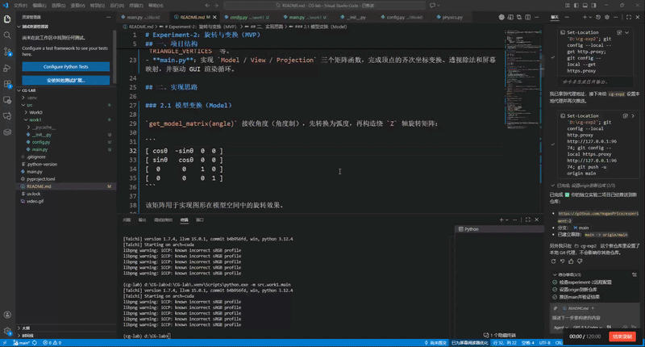
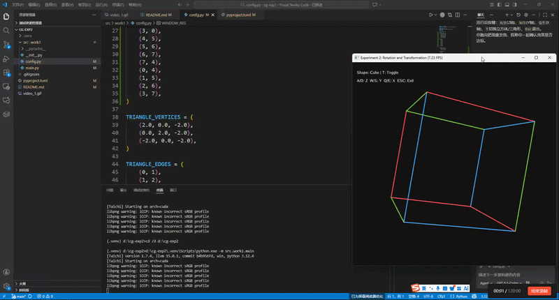

# Experiment-2：旋转与变换（MVP）

本项目是计算机图形学课程实验二的实现，使用 Taichi 框架完成了 MVP（Model-View-Projection）变换与交互旋转演示。基础任务支持线框三角形，选做任务扩展为线框立方体并支持三轴旋转。程序运行后会弹出一个 `700x700` 的窗口，可通过键盘交互控制旋转与图元切换。

## 一、项目结构

```
experiment-2/
├── pyproject.toml         # 项目配置与依赖声明
├── README.md              # 实验说明文档
└── src/
    └── work1/             # 实验 2（旋转与变换）
        ├── __init__.py
        ├── config.py      # 参数配置（窗口、相机、投影、图元与边）
        └── main.py        # MVP 矩阵实现、交互与渲染主循环
```

项目采用 `src` 布局，`work1` 为本次实验包，内部按职责拆分为两个核心模块：

- **config.py**：集中存放窗口参数、相机参数、投影参数和图元配置，如 `EYE_FOV`、`Z_NEAR`、`Z_FAR`、`TRIANGLE_VERTICES`、`CUBE_VERTICES` 等。
- **main.py**：实现 `Model / View / Projection` 三个矩阵函数，完成顶点的齐次坐标变换、透视除法和屏幕映射，并驱动 GUI 交互渲染循环。

## 二、实现思路

### 2.1 模型变换（Model）

`get_model_matrix(angle_z, angle_y=0, angle_x=0)` 接收三轴角度（角度制），先转换为弧度，再构造绕 `X/Y/Z` 轴旋转矩阵并进行组合：

```
[ R_z ] [ R_y ] [ R_x ]
```

组合后的模型矩阵用于实现图形在模型空间中的三维旋转效果。

### 2.2 视图变换（View）

`get_view_matrix(eye_pos)` 根据相机位置构造平移矩阵，将“相机平移到原点”等价为“场景按相反方向平移”：

```
[ 1  0  0  -eye_x ]
[ 0  1  0  -eye_y ]
[ 0  0  1  -eye_z ]
[ 0  0  0    1    ]
```

本实验中相机位置设为 `(0, 0, 5)`，观察方向沿 `-Z`。

### 2.3 投影变换（Projection）

`get_projection_matrix(eye_fov, aspect_ratio, zNear, zFar)` 按“透视到正交 + 正交投影”两步实现：

1. 先根据视场角和近裁剪面计算边界：
   - $t = \tan(\frac{fov}{2}) \cdot |n|$
   - $b = -t$
   - $r = aspect\_ratio \cdot t$
   - $l = -r$
2. 构造 $M_{\text{persp}\rightarrow\text{ortho}}$，将平截头体挤压到长方体。
3. 构造正交平移与缩放矩阵，得到 $M_{ortho}$。
4. 最终投影矩阵：$M_{proj} = M_{ortho} \cdot M_{\text{persp}\rightarrow\text{ortho}}$。

注意：本实验采用右手坐标系并看向 `-Z`，因此计算中使用 `n = -zNear`、`f = -zFar`。

### 2.4 MVP 合成与屏幕映射

对每个顶点使用列向量右乘规则：

$$MVP = M_{proj} \cdot M_{view} \cdot M_{model}$$

得到齐次坐标 `(x, y, z, w)` 后进行透视除法：

- `x_ndc = x / w`
- `y_ndc = y / w`
- `z_ndc = z / w`

再将 NDC 区间 `[-1, 1]` 映射到屏幕坐标区间 `[0, 1]`，用于 Taichi GUI 绘制线框图元（基础为三角形，选做为立方体）。

## 三、运行方法

环境要求：Python `>= 3.12`，Taichi `>= 1.7.4`，NumPy `>= 2.3.3`，支持 CUDA/Vulkan 的 GPU（无独显时也可退化运行）。

```bash
git clone https://github.com/HoganPrice/experiment-2.git
cd experiment-2

# 安装依赖（使用 uv）
pip install uv
uv sync

# 运行实验二
uv run python -m src.work1.main
```

如果只想检查矩阵与投影结果，可使用 dry-run：

```bash
uv run python -m src.work1.main --dry-run
```

## 四、关键参数说明

以下参数定义在 `src/work1/config.py` 中：

| 参数 | 默认值 | 含义 |
|------|--------|------|
| `WINDOW_RES` | `(700, 700)` | 窗口分辨率 |
| `EYE_POS` | `(0.0, 0.0, 5.0)` | 相机位置 |
| `EYE_FOV` | `45.0` | 纵向视场角（角度制） |
| `ASPECT_RATIO` | `1.0` | 屏幕长宽比 |
| `Z_NEAR` | `0.1` | 近裁剪面距离 |
| `Z_FAR` | `50.0` | 远裁剪面距离 |
| `ROTATE_STEP_DEG` | `10.0` | 每次按键旋转步长（角度） |
| `CUBE_VERTICES` | 8 个顶点 | 选做任务中的立方体顶点集合 |
| `CUBE_EDGES` | 12 条边 | 选做任务中的立方体线框边集合 |

## 五、交互与效果展示

程序成功运行后，默认显示线框立方体（可切换回三角形），按键交互如下：

- `A` / `D`：绕 `Z` 轴旋转
- `W` / `S`：绕 `Y` 轴旋转
- `Q` / `E`：绕 `X` 轴旋转
- `T`：在 `Cube` / `Triangle` 间切换
- `Esc`：退出程序

运行效果如下（`video_1.gif`）：



## 六、实验结论

通过本实验，完成了从三维模型坐标到二维屏幕坐标的完整变换链路，实现并验证了 `Model`、`View`、`Projection` 三个 `4x4` 齐次矩阵的构造方法，掌握了在 Taichi 中进行矩阵计算、齐次坐标透视除法和线框几何体实时渲染的基本流程。选做部分进一步实现了线框立方体、三轴旋转与图元切换，验证了 MVP 变换在真实三维几何体上的透视表现。

## 七、选做内容（仅供学有余力的同学选做）

### 7.1 目标

- 构建 3D 立方体并进行透视旋转（已完成）。

### 7.2 提示

- 构建三维几何体：在代码中定义一个三维正方体（Cube）。正方体有 8 个顶点和 12 条边，请将其中心放置在原点 `(0, 0, 0)`，边长为 2（即顶点坐标在 `[-1, 1]` 之间）。
- 修改渲染逻辑：将原本用于三角形的循环绘制逻辑，修改为遍历正方体的 12 条边进行线框绘制。
- 观察 3D 效果：你可以沿用基础任务中的模型旋转矩阵（或者尝试自己写一个绕 `Y` 轴或 `X` 轴旋转的矩阵）。通过 $$MVP$$ 矩阵变换后，你应该能在屏幕上看到一个具有透视效果的立体正方体在旋转。

### 7.3 完成情况

- 已在 `src/work1/config.py` 中补充 `CUBE_VERTICES`（8 个顶点）和 `CUBE_EDGES`（12 条边）。
- 已在 `src/work1/main.py` 中将投影函数泛化为可处理任意顶点集，并新增立方体线框绘制逻辑。
- 已支持绕 `X/Y/Z` 三轴旋转，默认展示立方体，可按 `T` 键切换三角形以对比基础任务与选做任务效果。

### 7.4 选做演示视频

选做任务运行效果如下：



## 八、依赖

- [Taichi](https://github.com/taichi-dev/taichi) >= 1.7.4
- NumPy >= 2.3.3
- Python >= 3.12
- 包管理工具：[uv](https://github.com/astral-sh/uv)
