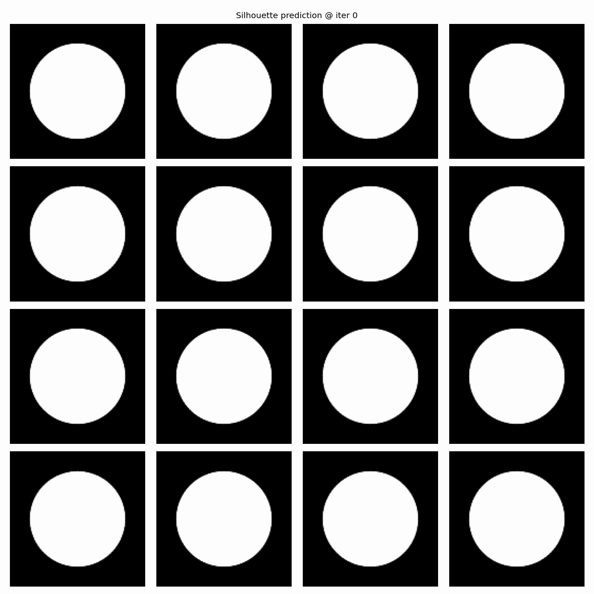
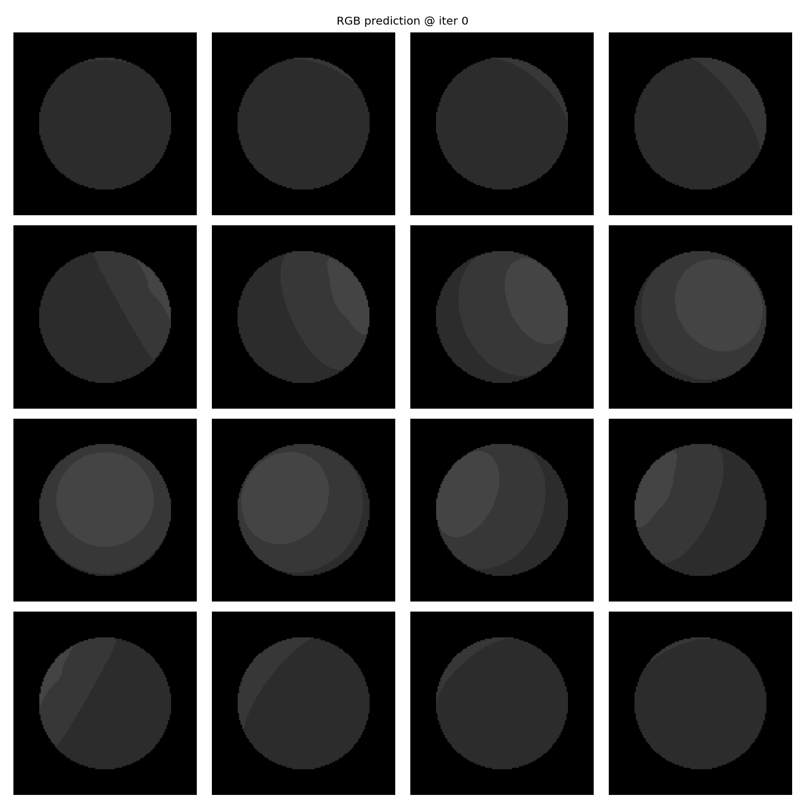

# 计算机图形学实验报告

| 项目 | 内容 |
| --- | --- |
| 实验名称 | 实验六：可微渲染 |
| 课程名称 | 计算机图形学 |
| 学生姓名 | 张书林 |
| 学号 | 202411081088 |
| 班级 | 24计算机 |
| 实验日期 | 2026 年 5 月 |

## 摘要

本实验基于 PyTorch3D 实现可微渲染中的三维网格优化。必做部分以一个初始球体作为源网格，通过多视角目标剪影监督优化顶点位移，使源网格逐渐拟合目标奶牛模型的外轮廓。选做部分进一步引入 RGB 图像监督，将顶点颜色作为可微参数，与几何形状进行联合优化。实验结果表明，软光栅化能够为轮廓附近的顶点位置提供有效梯度，多视角剪影约束可以较好地恢复目标模型的整体形状；但在同时优化颜色与几何时，若正则化约束不足，网格容易出现尖刺和不稳定形变。

关键词：可微渲染；PyTorch3D；软光栅化；剪影优化；网格正则化；顶点颜色

## 一、实验目的

1. 理解可微渲染的基本思想，掌握软光栅化产生可反传梯度的原理。
2. 使用 PyTorch3D 搭建多视角渲染与网格优化流程。
3. 通过目标剪影监督优化三维网格顶点，使初始球体拟合目标模型轮廓。
4. 在选做任务中加入 RGB 渲染与顶点颜色优化，观察几何与颜色联合优化的效果。
5. 分析图像损失与网格正则项对最终重建质量的影响。

## 二、实验环境

| 类型 | 配置 |
| --- | --- |
| 操作系统 | WSL/Linux 环境 |
| Python | 3.10.12 |
| 深度学习框架 | PyTorch 2.4.1 + CUDA 12.1 |
| 图形库 | PyTorch3D 0.7.8 |
| 其他依赖 | torchvision、matplotlib、imageio、iopath |
| GPU | NVIDIA GeForce RTX 4060 Laptop GPU |

项目主要文件如下：

| 文件或目录 | 说明 |
| --- | --- |
| `lab6_differentiable_rendering.py` | 实验主程序，包含模型加载、渲染器构建、损失计算、优化与结果导出 |
| `environment.yml` | Conda 环境配置文件 |
| `requirements.txt` | Python 依赖列表 |
| `data/cow_mesh/` | 目标奶牛模型与纹理文件 |
| `outputs/silhouette_400/` | 必做剪影优化结果与渐变 GIF |
| `outputs/joint_400/` | 选做 RGB 联合优化结果与渐变 GIF |

## 三、实验原理

### 3.1 可微渲染

传统硬光栅化在判断像素是否被三角形覆盖时使用离散规则，像素覆盖状态对顶点位置的变化通常不可导或梯度为零。因此，如果直接根据渲染图像与目标图像之间的误差优化网格顶点，反向传播很难有效更新模型形状。

可微渲染通过将硬覆盖关系替换为连续近似，使像素颜色或透明度对顶点位置保持可导。本实验使用 PyTorch3D 中的软光栅化方法，将像素到三角形边界的距离映射为连续概率，从而在物体轮廓附近产生有效梯度。这样，剪影图像的误差就可以通过渲染过程反向传播到网格顶点。

### 3.2 剪影优化

必做部分使用多视角目标剪影作为监督信号。设目标剪影为 `S_target`，当前预测剪影为 `S_pred`，剪影损失采用均方误差：

```text
L_silhouette = MSE(S_pred, S_target)
```

为了避免网格在优化过程中出现尖刺、局部塌陷或面片翻转，实验中加入三类网格正则项：

- 拉普拉斯平滑：约束顶点与邻域顶点的相对位置，减少局部噪声和尖刺。
- 边长一致性：惩罚异常边长，避免三角形过度拉伸。
- 法线一致性：约束相邻面片法线方向，增强表面连续性。

必做部分总损失函数为：

```text
L_total = L_silhouette
        + w_lap    * L_laplacian
        + w_edge   * L_edge
        + w_normal * L_normal
```

### 3.3 RGB 与顶点颜色联合优化

选做部分在剪影监督基础上加入 RGB 图像监督。程序使用 `SoftPhongShader` 渲染彩色图像，并通过 `TexturesVertex` 将每个顶点颜色作为可微参数参与优化。RGB 损失同样采用均方误差：

```text
L_rgb = MSE(I_pred, I_target)
```

选做部分总损失函数为：

```text
L_total = L_silhouette
        + w_rgb    * L_rgb
        + w_lap    * L_laplacian
        + w_edge   * L_edge
        + w_normal * L_normal
        + w_color  * L_color_smooth
```

其中 `L_color_smooth` 用于约束相邻顶点颜色变化，减少颜色噪声。

## 四、实验内容与实现步骤

本实验完成了必做剪影优化和选做 RGB 联合优化两部分。

### 4.1 数据准备

程序读取 `data/cow_mesh/cow.obj` 作为目标模型，同时加载对应的材质与纹理文件。为保证相机和渲染尺度一致，读取模型后先进行中心化和尺度归一化处理，使目标模型位于坐标系中心附近。

### 4.2 多视角相机设置

实验在水平方向均匀采样多个方位角，构建环绕目标模型的相机视角。多视角监督可以减少单一视角下的形状歧义，使优化结果在三维空间中更稳定。

### 4.3 源网格初始化

程序使用 `ico_sphere` 生成初始球体作为源网格。每个顶点的位移 `deform_verts` 被设置为可微参数，优化过程中实际渲染的网格由初始球体顶点加上位移得到。

### 4.4 剪影优化流程

1. 渲染目标奶牛模型的多视角剪影，作为监督信号。
2. 渲染当前源网格的多视角剪影。
3. 计算预测剪影与目标剪影的均方误差。
4. 计算拉普拉斯平滑、边长一致性和法线一致性正则项。
5. 使用 Adam 优化器更新顶点位移。
6. 定期保存预测图像、OBJ 网格、损失记录和损失曲线。

### 4.5 RGB 联合优化流程

在选做模式中，程序额外渲染目标 RGB 图像，并将源网格的顶点颜色作为可微参数。每次迭代同时计算剪影损失、RGB 损失和网格正则项，最终导出带逐顶点颜色的 OBJ 文件和 PyTorch 数据文件。

## 五、关键参数

| 参数 | 必做设置 | 选做设置 | 说明 |
| --- | --- | --- | --- |
| `mode` | `silhouette` | `joint` | 实验模式 |
| `n_iter` | 400 | 400 | 优化迭代次数 |
| `image_size` | 128 | 128 | 渲染图像分辨率 |
| `n_views` | 16 | 16 | 多视角数量 |
| `views_per_iter` | 8 | 8 | 每轮迭代使用的视角数 |
| `save_every` | 20 | 20 | 保存结果间隔 |
| `w_lap` | 0.08 | 0.08 | 拉普拉斯平滑权重 |
| `w_edge` | 0.8 | 0.8 | 边长正则权重 |
| `w_normal` | 0.01 | 0.01 | 法线一致性权重 |
| `w_rgb` | 0 | 0.05 | RGB 损失权重 |
| `rgb_start_iter` | - | 200 | 开始加入 RGB 损失的迭代次数 |

## 六、实验结果与分析

### 6.1 必做剪影优化结果

图 1 为从初始球体到目标奶牛剪影的优化过程 GIF。程序在第 0 次迭代保存初始 `ico_sphere` 球体剪影，之后每 20 次迭代保存一次预测结果，并在 400 次迭代后合成为动图。可以看到，源网格从各视角下的圆形轮廓逐渐产生头部、身体和四肢结构，最终接近目标奶牛模型的多视角剪影。



本次必做实验共保存 21 帧结果，包括第 0 次初始球体和第 20、40、...、400 次迭代结果。剪影损失从第 1 次迭代的 0.223908 下降到第 400 次迭代的 0.000529，说明多视角剪影监督能够有效驱动源球体变形并拟合目标奶牛轮廓。

### 6.2 选做 RGB 联合优化结果

图 2 为选做部分 RGB 与顶点颜色联合优化的过程 GIF。实验同样迭代 400 次，每 20 次保存一次结果。为了减轻 RGB 损失对早期几何优化的干扰，程序先进行剪影优化，并从第 200 次迭代开始加入较小权重的 RGB 损失。



与剪影图像相比，RGB 图像包含更多颜色、光照和局部外观信息，可以进一步约束顶点颜色和模型外观。但从图 2 可以观察到，当顶点位置和顶点颜色同时作为优化变量时，RGB 监督仍可能驱动网格通过异常形变来降低图像误差，导致几何形状出现尖刺和不稳定表面。这说明 RGB 联合优化比单纯剪影优化更难，需要更强的几何正则化或更明确的分阶段优化策略。

### 6.3 结果分析

必做剪影优化结果较为稳定，主要原因是剪影监督直接约束模型外轮廓，多视角设置可以从不同方向限制三维形状。拉普拉斯、边长和法线正则项也在一定程度上抑制了不规则变形。

选做 RGB 联合优化的难度更高。颜色误差不仅与顶点颜色有关，也与几何形状、光照、相机视角和遮挡关系有关。当顶点位置与顶点颜色同时作为优化变量时，优化目标更容易出现局部最优，网格可能通过产生尖刺或异常面片来减小图像误差。因此，后续可以尝试增大几何正则项权重、降低学习率、延迟开启 RGB 损失，或先完成剪影优化后再固定几何形状优化颜色。

## 七、实验中遇到的问题与解决方法

| 问题 | 原因分析 | 解决或改进方法 |
| --- | --- | --- |
| PyTorch3D 安装要求较严格 | PyTorch3D 与 Python、PyTorch、CUDA 版本绑定较紧 | 使用 WSL/Linux 环境，并安装匹配 CUDA 版本的 PyTorch 与 PyTorch3D |
| 初始阶段收敛速度快但后期变慢 | 网格已经接近目标轮廓，剩余误差主要来自细节差异 | 增加迭代次数或调整正则权重 |
| RGB 联合优化出现尖刺 | RGB 损失会影响几何形状，当前正则项不足以抑制异常变形 | 增大 `w_edge`、`w_normal` 或 `w_lap`，或采用分阶段优化 |
| 单看损失曲线难以判断效果 | 图像损失低不代表三维网格质量一定好 | 同时查看预测图、OBJ 网格和损失曲线 |

## 八、实验结论

本实验完成了基于 PyTorch3D 的可微渲染网格优化。实验表明，软光栅化可以将渲染图像误差有效传递到网格顶点，使得从二维剪影监督优化三维形状成为可能。多视角剪影监督能够较好地恢复目标模型的整体轮廓，网格正则化对保持表面稳定性具有重要作用。

选做部分说明，可微渲染不仅可以优化几何形状，也可以将颜色、纹理等外观参数纳入同一反向传播框架。但是，几何与颜色联合优化更容易产生不稳定结果，需要更合理的损失权重、优化策略和正则化设计。总体而言，本实验加深了对可微渲染、软光栅化和三维重建优化流程的理解。

## 九、参考文献

1. PyTorch3D 官方教程：[Render Textured Meshes](https://pytorch3d.org/tutorials/render_textured_meshes)
2. PyTorch3D 官方教程：[Fit a Mesh with Texture via Rendering](https://pytorch3d.org/tutorials/fit_textured_mesh)
3. PyTorch3D Documentation：[https://pytorch3d.org/](https://pytorch3d.org/)

## 附录：运行方式

创建 Conda 环境：

```bash
conda env create -f environment.yml
conda activate cg-lab6
```

使用当前工程已有虚拟环境查看参数：

```bash
.venv/bin/python lab6_differentiable_rendering.py --help
```

运行必做剪影优化：

```bash
.venv/bin/python lab6_differentiable_rendering.py \
  --mode silhouette \
  --output_dir outputs/silhouette_400 \
  --n_iter 400 \
  --image_size 128 \
  --n_views 16 \
  --views_per_iter 8 \
  --save_every 20 \
  --log_every 20 \
  --make_gif \
  --no_download
```

运行选做 RGB 联合优化：

```bash
.venv/bin/python lab6_differentiable_rendering.py \
  --mode joint \
  --output_dir outputs/joint_400 \
  --n_iter 400 \
  --image_size 128 \
  --n_views 16 \
  --views_per_iter 8 \
  --save_every 20 \
  --log_every 20 \
  --w_rgb 0.05 \
  --rgb_start_iter 200 \
  --make_gif \
  --no_download
```
