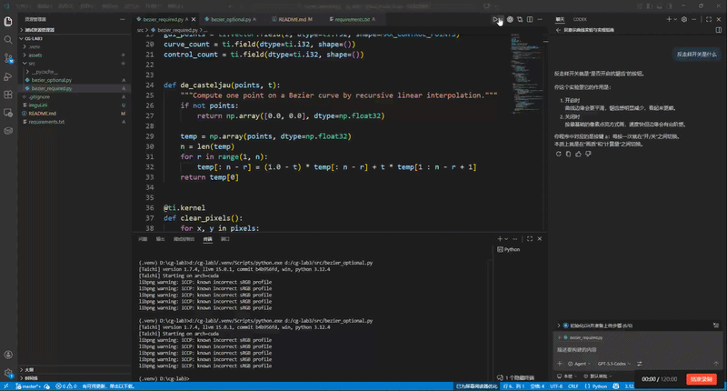
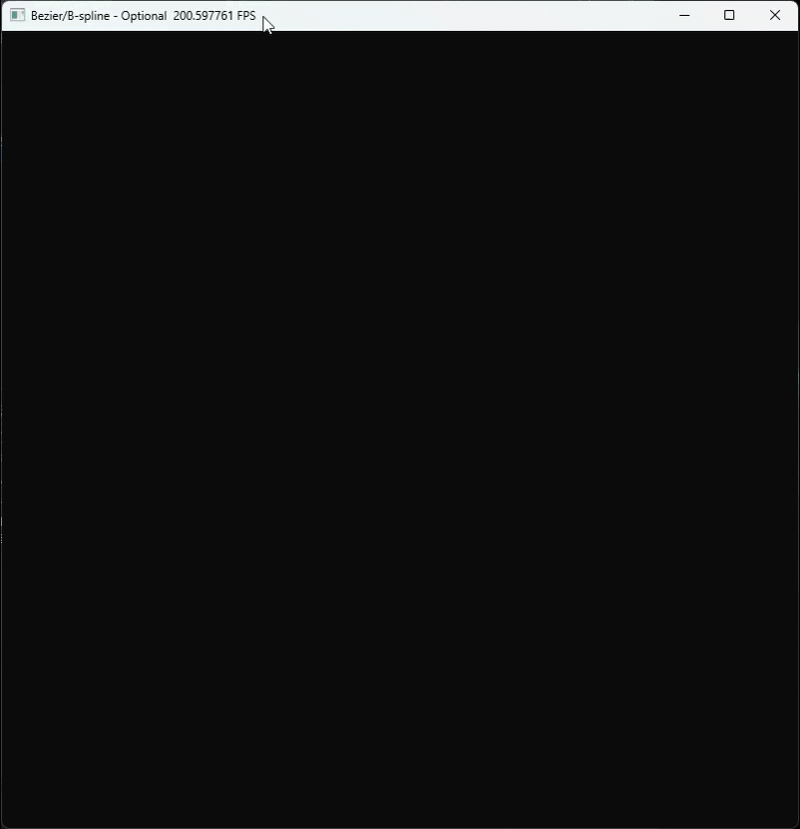
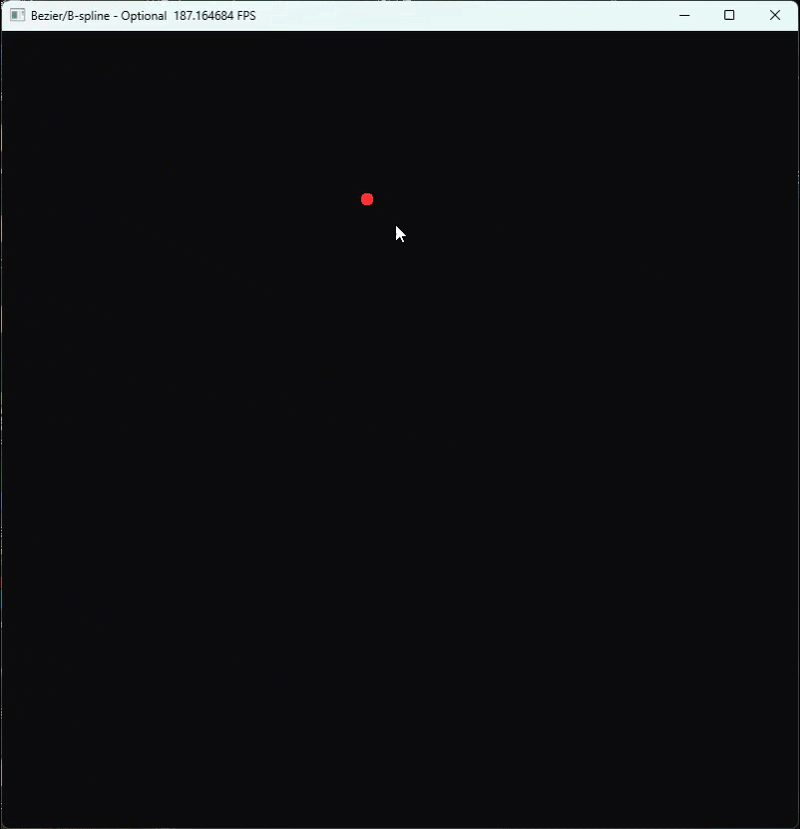

# 计算机图形学实验三报告

## 1. 实验信息

 - 姓名 张书林
 - 学号 202411081088
 - 专业 24级计算机科学与技术

## 2. 实验目标

1. 理解贝塞尔曲线的几何意义。
2. 使用 De Casteljau 算法计算曲线点。
3. 理解并实现像素级光栅化。
4. 掌握鼠标与键盘的图形交互事件处理。

## 3. 必做部分实现

### 3.1 核心思路

1. 预分配固定大小显存缓冲区：
	- pixels: 800x800 RGB 缓冲区
	- curve_points_field: 长度 1001，用于接收 CPU 批量采样结果
	- gui_points: 长度 100，用于控制点对象池
2. CPU 端使用 De Casteljau 采样 1001 个曲线点。
3. 将采样结果一次性拷贝至 GPU，并在 kernel 中并行光栅化。
4. 主循环中处理交互：左键添加点，c 清空。

### 3.2 De Casteljau 算法

对于参数 $t \in [0, 1]$，使用递归线性插值：

$$
P_i^{(r)}(t) = (1-t) P_i^{(r-1)}(t) + t P_{i+1}^{(r-1)}(t)
$$

最终得到唯一点 $P_0^{(n-1)}(t)$ 作为曲线在参数 $t$ 处的位置。

### 3.3 光栅化策略

1. 归一化坐标 $(x, y)$ 映射为像素索引：

$$
px = \lfloor x (W-1) \rfloor, \quad py = \lfloor y (H-1) \rfloor
$$

2. 在 kernel 内进行越界判断后点亮对应像素。
3. 控制多边形同样通过 kernel 分段采样后绘制为灰色。

### 3.4 对象池绘制控制点

由于 circles 接口使用定长 field，采用长度 100 的 NumPy 数组作为中转：

1. 先填充为 -10（屏幕外）。
2. 再把真实控制点覆盖到前 n 项。
3. 一次性 from_numpy 到 gui_points。

## 4. 选做部分实现

本实验实现了两个选做方向，并整合到同一程序中。

### 4.1 反走样（Anti-Aliasing）

1. 对每个曲线浮点坐标，考察其 3x3 像素邻域。
2. 根据像素中心到几何点距离计算权重：

$$
w = \max\left(0, 1 - \frac{d}{1.5}\right)
$$

3. 使用原子最大值将权重写入强度缓冲区。
4. 最终将背景色与曲线色按权重混合，得到平滑边缘。

### 4.2 均匀三次 B 样条

1. 采用每 4 个相邻控制点构成一段曲线。
2. 对每个采样参数 $u$ 使用三次均匀 B 样条基函数：

$$
\begin{aligned}
B_0(u) &= \frac{-u^3 + 3u^2 - 3u + 1}{6} \\
B_1(u) &= \frac{3u^3 - 6u^2 + 4}{6} \\
B_2(u) &= \frac{-3u^3 + 3u^2 + 3u + 1}{6} \\
B_3(u) &= \frac{u^3}{6}
\end{aligned}
$$

3. 曲线点按线性组合计算：

$$
P(u) = B_0 P_i + B_1 P_{i+1} + B_2 P_{i+2} + B_3 P_{i+3}
$$

4. 通过按键 b 在 Bezier 与 B 样条模式间切换。

## 5. 交互说明

### 5.1 必做程序

- 鼠标左键：添加控制点
- 键盘 c：清空控制点

### 5.2 选做程序

- 鼠标左键：添加控制点
- 键盘 c：清空控制点
- 键盘 b：Bezier/B-spline 模式切换
- 键盘 a：反走样开关

## 6. 结果分析

1. 贝塞尔曲线具有全局控制特性：任一控制点变化会影响整条曲线。
2. B 样条曲线具有更好的局部控制特性，控制点增多时更稳定。
3. 反走样后曲线边缘锯齿明显减轻，视觉连续性更好。

## 7. 文件结构

- src/bezier_required.py：必做部分代码
- src/bezier_optional.py：选做部分代码（AA + B 样条）
- requirements.txt：依赖列表
- README.md：实验报告与运行说明
- report.md：实验报告（与 README.md 保持一致）

## 8. 运行效果展示

请将 GIF 文件放入 assets/gif 目录后替换或直接覆盖同名文件。

### 8.1 必做：Bezier 曲线动态效果

### 8.2 选做：反走样开关对比

### 8.3 选做：Bezier 与 B 样条切换对比

## 9. 实验总结

本实验完成了从曲线数学模型到像素级渲染与交互系统的完整闭环：

1. CPU 负责曲线采样计算。
2. GPU 负责并行像素绘制。
3. 通过批处理减少 CPU-GPU 往返开销。
4. 通过对象池与固定显存设计提升实时渲染稳定性。
