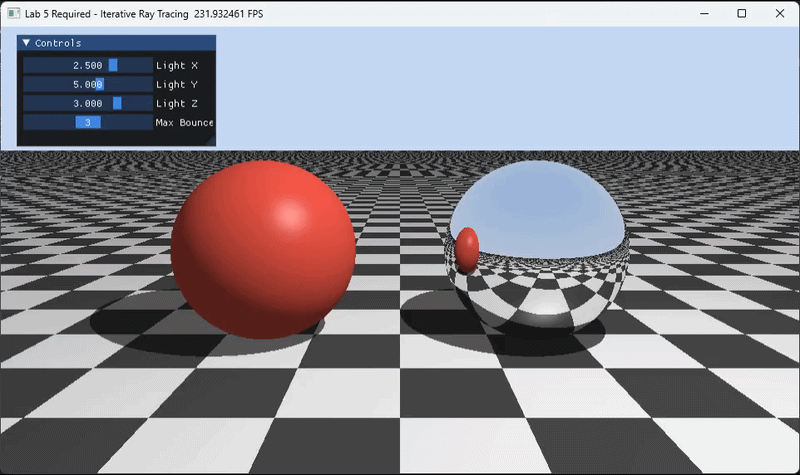
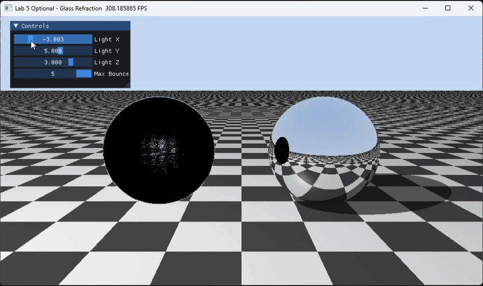

# 实验五：Whitted-Style 光线追踪实验报告
 - 姓名 张书林
 - 学号 202411081088
 - 专业 24级计算机科学与技术
## 一、实验目标

本实验使用 Taichi 实现一个基于 GPU 的 Whitted-Style 光线追踪程序。实验重点包括：

1. 理解光线投射和光线追踪的区别。光线投射只计算主光线与场景的第一次相交，而光线追踪会继续发射次级射线，用于阴影、反射和折射等全局光照效果。
2. 掌握硬阴影和理想镜面反射的实现方法。硬阴影通过从交点向光源发射暗影射线判断遮挡；镜面反射通过反射公式生成新的反射射线继续追踪。
3. 理解 GPU 程序中用迭代方式替代递归的思想。传统 CPU 光线追踪常使用递归追踪反射和折射，但 GPU kernel 更适合固定上限的 `for` 循环。
4. 在必做内容基础上完成两个选做功能：玻璃材质折射和 MSAA 抗锯齿。

## 二、程序文件说明

本次实验共完成三个独立程序：

| 文件名 | 内容 |
| --- | --- |
| `raytracing_required.py` | 必做程序：棋盘格地面、红色漫反射球、银色镜面球、硬阴影、镜面反射、UI 控制 |
| `raytracing_glass_optional.py` | 选做程序一：在必做基础上将红球改为玻璃球，实现折射和全反射 |
| `raytracing_msaa_optional.py` | 选做程序二：在必做基础上加入每像素 4 次随机采样，实现抗锯齿 |

## 三、实验环境

- 编程语言：Python
- 图形计算框架：Taichi
- 渲染方式：Taichi GPU kernel 并行计算每个像素颜色
- 交互窗口：`ti.ui.Window`

运行命令：

```bash
python raytracing_required.py
python raytracing_glass_optional.py
python raytracing_msaa_optional.py
```

窗口左上角提供交互面板：

- `Light X`、`Light Y`、`Light Z`：实时调整点光源位置。
- `Max Bounces`：调整最大光线弹射次数，范围为 1 到 5。

## 四、必做程序实现

对应文件：`raytracing_required.py`

### 4.1 场景搭建

必做程序没有导入任何外部模型，所有几何体都在 Taichi kernel 中通过数学公式隐式定义。

场景包括三个物体：

1. 无限大地面平面
   - 位置：`y = -1.0`
   - 法线：`(0, 1, 0)`
   - 材质：漫反射
   - 纹理：黑白棋盘格，通过交点的 `x` 和 `z` 坐标取整后判断奇偶性生成。

2. 红色漫反射球
   - 球心：`(-1.5, 0.0, 0.0)`
   - 半径：`1.0`
   - 材质：漫反射

3. 银色镜面球
   - 球心：`(1.5, 0.0, 0.0)`
   - 半径：`1.0`
   - 材质：理想镜面反射

程序中使用材质 ID 区分不同物体：

| 材质 ID | 含义 |
| --- | --- |
| `1` | 棋盘格地面 |
| `2` | 红色漫反射球 |
| `3` | 银色镜面球 |

### 4.2 光线与场景求交

每个像素从摄像机位置发射一条主光线。程序分别计算该光线与平面、红球、镜面球的交点，并选择距离摄像机最近的有效交点作为最终命中结果。

球体求交使用二次方程。设光线为：

```text
P(t) = O + tD
```

其中 `O` 是光线起点，`D` 是单位方向。将其代入球方程可求得交点参数 `t`。

平面求交使用：

```text
t = (plane_y - ray_origin.y) / ray_dir.y
```

只有 `t > EPS` 的交点才认为有效，用来避免光线与自身表面发生自相交。

### 4.3 迭代式光线弹射

传统光线追踪常写成递归形式，但 GPU 不适合无限递归。因此本实验使用固定次数的 `for` 循环实现反射弹射。

核心变量：

- `final_color`：最终颜色，初始为黑色。
- `throughput`：光线吞吐量，表示当前光线路径的能量衰减，初始为 `(1, 1, 1)`。
- `max_bounces`：最大弹射次数，由 UI 滑动条控制。

处理逻辑：

1. 如果光线没有击中物体，则采样天空背景色并结束。
2. 如果击中漫反射物体，则计算 Phong 光照，将结果乘以 `throughput` 后累加到 `final_color`，然后结束。
3. 如果击中镜面物体，则根据反射公式计算新方向，更新光线起点和方向，并令 `throughput *= 0.8` 继续下一次循环。

反射方向公式为：

```text
R = L_in - 2 * dot(L_in, N) * N
```

其中 `L_in` 是入射光线方向，`N` 是表面法线。

### 4.4 硬阴影实现

在漫反射物体着色时，程序从交点向点光源方向发射一条暗影射线。

如果暗影射线在到达光源之前击中了其他物体，则说明该点被遮挡，处于阴影中，只保留环境光；否则计算漫反射和高光项。

阴影判断逻辑：

```text
shadow_hit == true and shadow_t < light_distance
```

这种方法得到的是硬阴影，因为光源被视为一个没有面积的点光源，阴影边界不会产生半影过渡。

### 4.5 Shadow Acne 处理

如果直接从交点再次发射反射射线或暗影射线，由于浮点误差，新射线可能立刻与原来的物体表面再次相交，产生黑色噪点或错误阴影。

为了解决这个问题，程序将新射线起点沿法线方向偏移一个很小的距离：

```text
P_new = P + N * EPS
```

本实验中 `EPS = 1e-4`。暗影射线和反射射线都使用该偏移方式。

### 4.6 UI 交互

程序使用 `ti.ui.Window` 创建窗口，并使用滑动条实时修改参数：

- 改变 `Light X / Light Y / Light Z` 可以观察阴影方向和长度变化。
- 将 `Max Bounces` 设为 1 时，镜面球基本只能显示直接命中结果，无法看到明显的镜中反射。
- 将 `Max Bounces` 设为 2 或更高时，镜面球会继续追踪反射光线，可以看到反射出的地面、球体和天空背景。

## 五、选做程序一：玻璃折射

对应文件：`raytracing_glass_optional.py`

### 5.1 功能说明

该程序在必做场景基础上，将左侧红色漫反射球改为玻璃球。玻璃球不再直接使用漫反射着色，而是根据折射定律生成折射光线继续追踪。

新增材质 ID：

| 材质 ID | 含义 |
| --- | --- |
| `4` | 玻璃球 |

### 5.2 Snell 定律

折射方向根据 Snell 定律计算。空气折射率近似为 `1.0`，玻璃折射率设置为：

```text
IOR_GLASS = 1.5
```

当光线从空气进入玻璃时：

```text
eta = 1.0 / 1.5
```

当光线从玻璃内部射出到空气时：

```text
eta = 1.5
```

程序根据光线方向和法线方向的点积判断当前光线是在进入玻璃还是离开玻璃，并相应翻转法线。

### 5.3 全反射处理

当折射计算中出现：

```text
sin2_t > 1.0
```

说明折射方向不存在，发生全反射。此时程序不再生成折射光线，而是改为生成反射光线继续追踪。

### 5.4 Fresnel 近似

程序使用 Schlick 近似计算 Fresnel 反射比例：

```text
F = 0.04 + 0.96 * (1 - abs(dot(I, N)))^5
```

当视角非常倾斜时，玻璃表面反射会更明显。程序根据 Fresnel 值在折射和反射之间进行简化选择，使玻璃球边缘具有更强的反射效果。

### 5.5 实现效果

玻璃球会折射背景、地面棋盘格和其他物体。最大弹射次数越高，玻璃球内部和出射后的光线路径越完整。由于折射通常需要进入和离开玻璃两次求交，因此该程序默认 `Max Bounces = 5`。

## 六、选做程序二：MSAA 抗锯齿

对应文件：`raytracing_msaa_optional.py`

### 6.1 功能说明

基础版本每个像素只发射一条主光线，因此球体边缘和棋盘格边缘会有明显锯齿。MSAA 版本在每个像素内部随机采样多条主光线，并将颜色取平均，从而让边缘过渡更加平滑。

### 6.2 采样方式

程序设置：

```text
MSAA_SAMPLES = 4
```

每个像素内随机生成 4 组偏移量：

```text
ox = random(0, 1)
oy = random(0, 1)
```

然后使用 `(i + ox, j + oy)` 作为该次采样的像素内位置，生成对应主光线。

### 6.3 颜色平均

每条采样光线都会执行和必做程序相同的光线追踪过程，包括：

- 场景求交
- 漫反射着色
- 硬阴影测试
- 镜面反射弹射

最后将 4 次采样颜色求平均：

```text
color = (c1 + c2 + c3 + c4) / 4
```

这样可以降低单像素采样导致的边缘跳变，使球体轮廓和棋盘格边缘更加平滑。

## 七、实验结果分析

### 7.1 必做结果

必做程序能够显示一个包含地面、漫反射球和镜面球的三维场景。移动光源时，地面和球体上的硬阴影会实时变化。调节最大弹射次数时，可以明显看到镜面球反射效果的变化。

当 `Max Bounces = 1` 时，光线只发生一次命中，镜面球不会继续追踪反射后的世界。

当 `Max Bounces > 1` 时，镜面球命中后会继续生成反射光线，因此能够看到地面棋盘格、红球和天空背景的反射。

实验效果演示 GIF：



### 7.2 玻璃折射结果

玻璃版本中，左侧球体会产生折射效果。由于玻璃球改变了光线路径，透过球体可以看到被扭曲的背景和棋盘格。增加最大弹射次数后，折射路径更加完整。

该版本还处理了全反射情况，使光线在无法折射时自动切换为反射路径。

实验效果演示 GIF：



### 7.3 MSAA 结果

MSAA 版本相比基础版本，球体边缘和棋盘格远处边缘更加平滑，锯齿感减弱。代价是每个像素需要追踪 4 条主光线，计算量约为基础版本的 4 倍，因此运行速度会更慢。

实验效果演示 GIF：


## 八、实验总结

通过本次实验，我完成了一个基于 Taichi 的 GPU 光线追踪程序。必做部分实现了隐式几何体求交、材质 ID 系统、Phong 着色、硬阴影、镜面反射和迭代式光线弹射。选做部分进一步实现了玻璃折射、全反射处理和 MSAA 抗锯齿。

本实验的关键收获是理解了光线追踪中次级射线的作用：暗影射线用于判断遮挡，反射射线用于生成镜面效果，折射射线用于模拟透明材质。同时也理解了在 GPU 编程中需要将递归算法改写为固定上限循环，以便适应并行计算模型。

## 九、遇到的问题与解决方法

1. 自相交导致阴影错误

   问题：暗影射线或反射射线从物体表面出发时，可能立刻击中自身，造成黑色噪点或错误阴影。

   解决：所有次级射线起点都沿法线方向偏移 `EPS = 1e-4`。

2. GPU 不适合递归

   问题：递归式光线追踪不适合直接写入 Taichi kernel。

   解决：使用 `for` 循环和 `max_bounces` 控制最大弹射次数。

3. 折射方向需要区分进入和离开介质

   问题：玻璃球折射时，如果不判断光线是在进入还是离开玻璃，会导致折射方向错误。

   解决：通过 `dot(ray_dir, normal)` 判断光线位置，并在离开玻璃时翻转法线和调整折射率比例。
