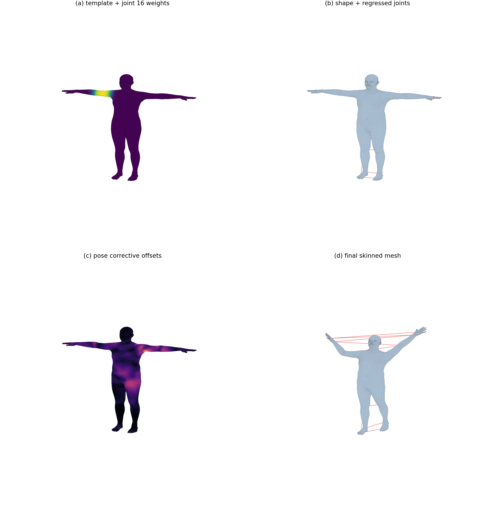
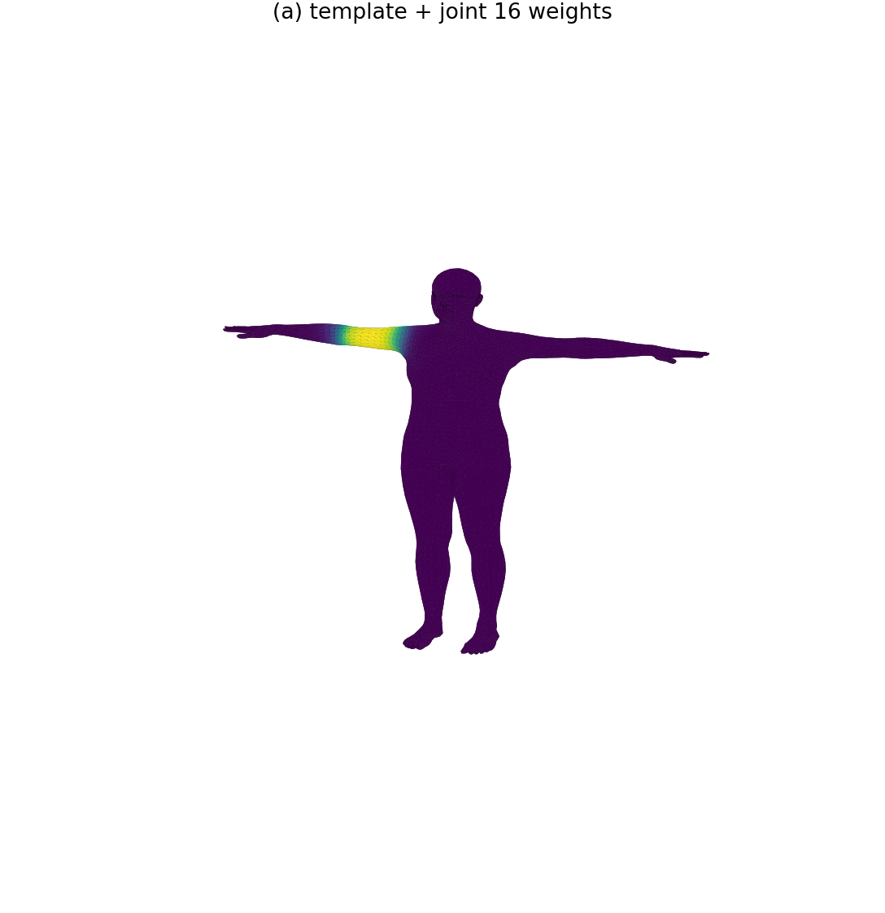
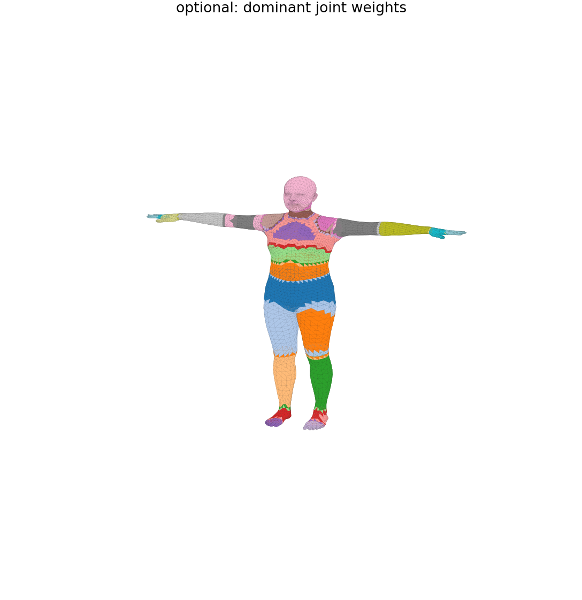
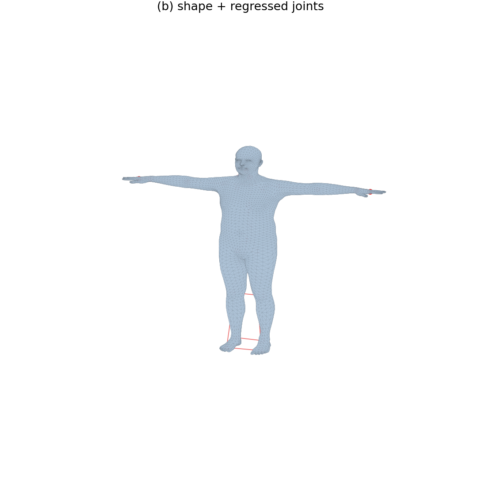
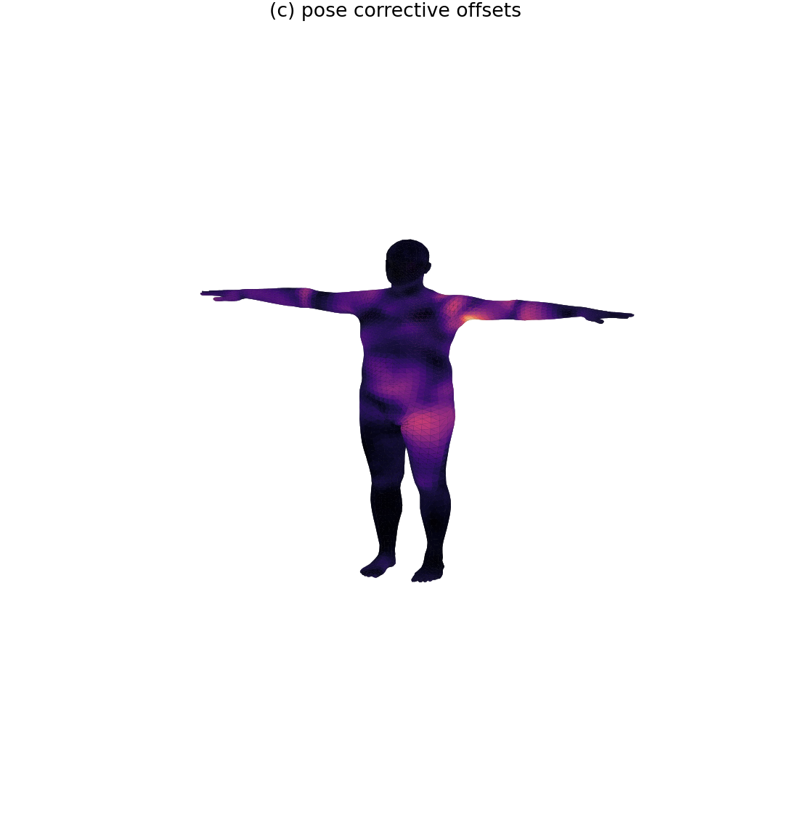
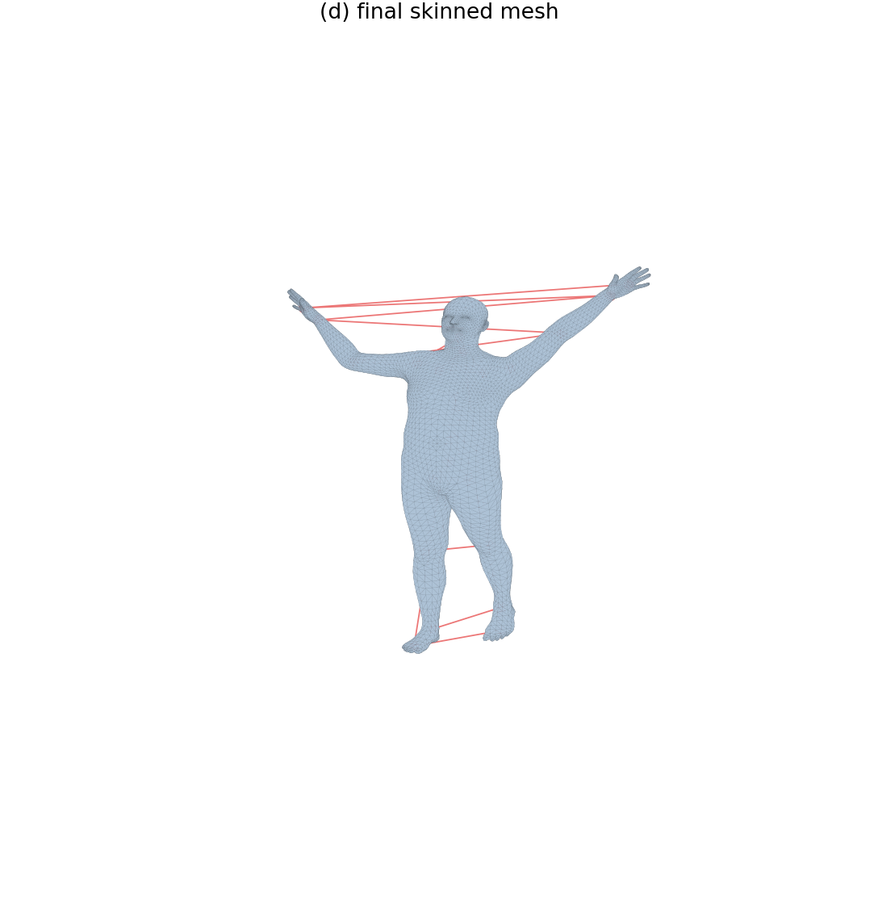
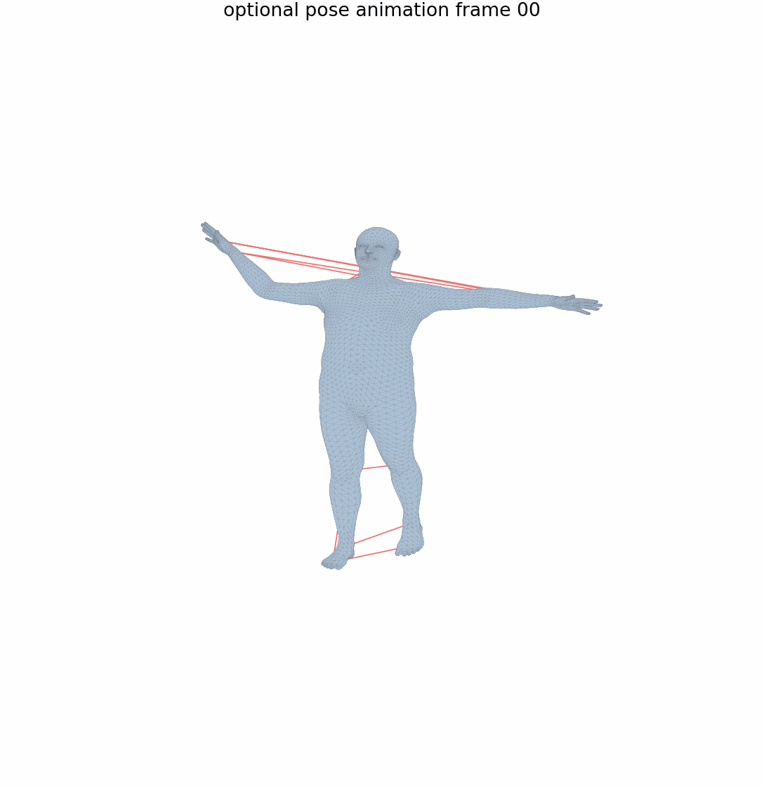

# 计算机图形学实验八：LBS 蒙皮

## 一、实验信息

 - 姓名 张书林
 - 学号 202411081088
 - 专业 24级计算机科学与技术
## 二、实验目标

本实验基于 SMPL 人体模型完成一次完整的 Linear Blend Skinning 蒙皮流程，并将官方 `lbs()` 中的关键中间量拆出来可视化。实验主要目标如下：

1. 理解模板网格、形状参数、姿态参数、关节回归器和蒙皮权重之间的关系。
2. 明确区分 `v_template`、`v_shaped`、`J`、`v_posed`、`verts` 五个核心对象。
3. 手写 LBS 前向过程，并与 `smplx` 官方前向结果做数值一致性验证。
4. 输出四个阶段的可视化结果，以及选做的姿态动画 GIF。

## 三、运行方式

先安装依赖：

```bash
pip install -r requirements.txt
```

将 `SMPL_NEUTRAL.pkl` 放入 `data/` 目录：

```text
src/experiment-8/data/SMPL_NEUTRAL.pkl
```

脚本也兼容 `data/smpl/SMPL_NEUTRAL.pkl` 和直接通过 `--model-dir` 指向 `.pkl` 文件的写法。

运行实验：

```bash
python lbs_smpl_lab.py --model-dir data --output-dir outputs
```

如果希望使用 GPU：

```bash
python lbs_smpl_lab.py --device cuda
```

## 四、程序文件说明

| 文件或目录 | 内容 |
| --- | --- |
| `lbs_smpl_lab.py` | 实验主程序，包含手写 LBS、可视化、官方结果验证和选做动画导出 |
| `requirements.txt` | Python 依赖列表 |
| `data/` | 放置 `SMPL_NEUTRAL.pkl`，模型文件不提交到仓库 |
| `outputs/` | 保存实验结果图片、GIF 和 `summary.txt` |

## 五、实验原理

### 5.1 模板网格与蒙皮权重

SMPL 的初始人体网格为模板顶点 `v_template`，通常处于 T-pose。每个顶点还带有一组对各个关节的蒙皮权重 `lbs_weights`。权重越大，说明该关节对这个顶点的最终运动影响越强。

本实验在阶段 (a) 中输出两张图：

- `stage_a_template_weights.png`：显示指定关节对所有顶点的影响权重。
- `all_joint_weights.png`：显示每个顶点由哪个关节主导控制，用于辅助理解全身权重分布。

### 5.2 形状校正与关节回归

形状参数 `betas` 控制人体体型。加入形状 blend shape 后得到：

```text
v_shaped = v_template + blend_shapes(betas, shapedirs)
```

关节位置并不是固定常数，而是由形状变化后的网格回归得到：

```text
J = J_regressor @ v_shaped
```

这样当人物变高、变胖或四肢比例发生变化时，肩、髋、膝等关节位置也会随之变化。阶段 (b) 将 `v_shaped` 和回归出的关节点叠加显示。

### 5.3 姿态校正

SMPL 在真正执行 LBS 前，会根据姿态旋转矩阵加入 pose corrective：

```text
pose_feature = R(theta) - I
pose_offsets = pose_feature @ posedirs
v_posed = v_shaped + pose_offsets
```

这一项用于补偿弯曲关节附近仅靠刚体旋转难以表达的局部几何变化。阶段 (c) 使用颜色显示 `pose_offsets` 的大小，可以观察到修正主要集中在发生弯曲和旋转的身体部位附近。

### 5.4 线性混合蒙皮

最后，根据运动学树计算每个关节的全局刚体变换，再使用顶点的蒙皮权重进行加权求和：

```text
v_i' = sum_k w_ik G_k(theta, J(beta)) [v_i_posed, 1]^T
```

阶段 (d) 显示最终蒙皮后的 `verts` 和变换后的 `J_transformed`。

需要注意的是，SMPL 模型坐标通常以 `Y` 轴为竖直方向，而 Matplotlib 3D 绘图默认更接近 `Z` 轴向上的显示习惯。本实验只在可视化函数中将 `(x, y, z)` 映射为 `(x, z, y)`，使人体在输出图片中保持站立；LBS 计算、官方前向对比和误差验证仍然使用原始 SMPL 坐标。

## 六、实验内容与实现

### 6.1 必做部分

本实验脚本完成了以下任务：

1. 加载 `SMPL_NEUTRAL.pkl`，输出顶点数、面片数、关节数和 `betas` 维度。
2. 可视化模板网格和单关节蒙皮权重。
3. 设置非零 `betas`，计算并显示 `v_shaped` 和回归出的 `J`。
4. 设置非零姿态参数，计算 `pose_offsets` 和 `v_posed`，并以热力图显示姿态校正幅度。
5. 手写完整 LBS，得到最终 `verts` 和 `J_transformed`。
6. 生成四阶段对比图 `comparison_grid.png`。
7. 使用相同参数调用官方 SMPL 前向，计算手写 LBS 与官方结果之间的平均绝对误差和最大绝对误差，并保存到 `summary.txt`。

### 6.2 选做部分

选做部分固定形状参数，让一个身体关节的姿态角从 `0` 逐渐旋转到指定角度，逐帧执行手写 LBS 并渲染结果，最终导出：

```text
outputs/optional_pose_animation.gif
```

默认动画参数为：

| 参数 | 默认值 | 含义 |
| --- | --- | --- |
| `--animation-joint` | `16` | 参与动画的 body pose 关节索引 |
| `--animation-angle` | `1.2` | 最终绕 z 轴旋转角度，单位为弧度 |
| `--animation-frames` | `24` | GIF 帧数 |

## 七、输出结果

运行后 `outputs/` 目录应包含：

```text
outputs/
├── stage_a_template_weights.png
├── all_joint_weights.png
├── stage_b_shaped_joints.png
├── stage_c_pose_offsets.png
├── stage_d_lbs_result.png
├── comparison_grid.png
├── optional_pose_animation.gif
└── summary.txt
```

其中：

- `stage_a_template_weights.png` 展示模板网格和单关节权重热力图。
- `all_joint_weights.png` 展示全身主导关节权重分布。
- `stage_b_shaped_joints.png` 展示形状变化后的网格和回归关节。
- `stage_c_pose_offsets.png` 展示姿态校正偏移量的空间分布。
- `stage_d_lbs_result.png` 展示完整 LBS 后的最终姿态。
- `comparison_grid.png` 将四个阶段放在同一张图中对比。
- `summary.txt` 记录模型基础信息和手写 LBS 与官方前向的误差。

### 7.1 四阶段总览



### 7.2 阶段结果

模板网格与单关节蒙皮权重：



全身主导关节权重分布：



形状变化后的网格与关节回归：



姿态校正偏移量：



完整 LBS 后的最终姿态：



### 7.3 选做动画



## 八、思考题

### 8.1 为什么一个顶点不只受一个关节影响？

人体表面在关节附近通常跨越多个骨骼影响区域。例如肩部、肘部、髋部和膝盖附近的皮肤并不会完全跟随单一骨骼刚性运动。如果只选择最大权重的关节，弯曲处会出现明显断裂或折痕；使用多个关节加权可以让变形更加平滑。

### 8.2 如果权重几乎全部给某一个关节，会出现什么效果？

该顶点会近似刚性地跟随这个关节运动。对于远离关节的身体区域这是合理的，但如果发生在关节连接处，就会让表面缺少平滑过渡，容易产生生硬的折线和体积塌陷。

### 8.3 如果权重分布过于平均，会出现什么效果？

顶点会同时受多个关节强烈拉扯，运动会变得发软、拖拽感强，局部形状也可能偏离真实解剖结构。因此合理权重通常是在主导关节附近集中，同时在关节交界处保留平滑过渡。

### 8.4 为什么关节位置要从形状后的网格回归？

不同体型的人体关节位置会发生变化。若关节位置固定，胖瘦、高矮、肩宽和腿长变化后，骨架仍停留在模板人体的位置，会导致后续姿态变换和蒙皮结果不一致。使用 `v_shaped` 回归 `J` 可以让骨架适应当前体型。

### 8.5 `v_shaped` 和 `v_posed` 的区别是什么？

`v_shaped` 只包含体型变化，描述这个人静态长什么样；`v_posed` 在此基础上加入姿态相关的局部校正，但还没有真正经过关节刚体变换。最终姿态网格 `verts` 还需要经过 LBS 加权变换得到。

### 8.6 `J` 和 `J_transformed` 有什么区别？

`J` 是根据形状后网格回归出的静态关节位置，处在蒙皮前的骨架空间中；`J_transformed` 是姿态旋转沿运动学树传播后得到的关节位置，表示最终姿态下骨架在空间中的位置。

## 九、实验总结

本实验将 SMPL 的 LBS 前向过程拆分为模板权重、形状校正、姿态校正和最终蒙皮四个阶段。通过逐阶段可视化，可以清楚看到 SMPL 并不是简单地旋转骨骼，而是先根据形状参数调整人体网格和关节，再根据姿态加入局部几何修正，最后使用蒙皮权重对关节变换做线性混合。

手写 LBS 与官方前向结果的误差记录在 `summary.txt` 中。若模型参数和数据类型一致，误差应接近浮点计算精度范围，说明手写实现与官方实现保持一致。
